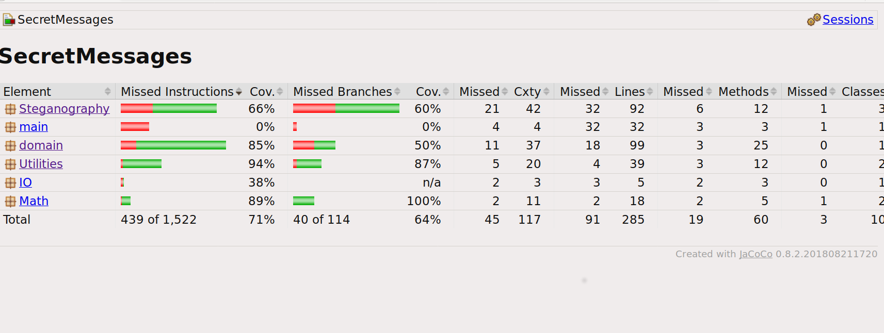

# Testing document

## Unit testing

Classes have JUnit tests. In the case of echo hiding, I use test WAV files to ensure I can encode and decode messages. 

## Performance testing

I did some preliminary tests on different actions. The test file is a WAV file under 1 minute in length, approx. 9MB in size.

| Action | Run 1 | Run 2 | Run 3 |
|-|-|-|-|
| LSB Encoding | 24ms | 24ms | 21ms |
| LSB Decoding | 3ms | 4ms | 5ms |
| EH Encoding | 104ms | 93ms | 94ms |
| EH Decoding | 439m | 407ms | 414ms | 

## Test reports

### Third test report

.

### Second test report

.

### First report

.