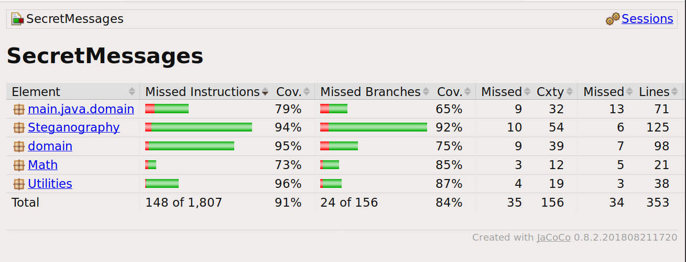

# Testing document

## Unit testing

Classes have JUnit tests. In the case of echo hiding, I use test WAV files to ensure I can encode and decode messages. 

## Performance testing

I tested 3 files to see how long these things take.

Echo hiding was tested using segment length of 16384 frames. Increasing segment length tends increases the amount of time taken to decode, but I did not test this further.

D0 was set as 150, d1 as 300. Testing was done with an 8th gen i5 (I don't know the GHz, but it's quite fast).

Notably, with a block size of 16384, roughly 1/10 of characters excavated with from echo-hidden files are distorted. The reason for this is not entirely clear. Longer segments equal higher accuracy.

Durations were measured twofold: the first value is from click to completion, and the second from inside the encoding/decoding method. As the results show, significant overhead is introduced by e.g. array handling and other preparations.

Below, I've used parentheses to mark values gained from wrapping the algorithm directly.

### File 1

- File: 44kHz.wav
- Track length: 0:52
- Sampling rate: 44.1kHz
- File size: 9.6MB
- Type: Classical
- Maximum length of message: 18 characters

| Action | Run 1 | Run 2 | Run 3 |
|-|-|-|-|
| LSB Encoding | 67ms (15ms) | 59ms (11ms) | 38ms (14ms) |
| LSB Decoding | 51ms (4ms) | 52ms (4ms) | 50ms (4ms) |
| EH Encoding | 91ms (35ms) | 88ms (33ms) | 90ms (34ms) |
| EH Decoding | 179m (120ms) | 166ms (119ms) | 177ms (129ms) | (Using Java's own natural logarithm function)

### File 2

- File: 0842.wav
- Track length: 2:34
- Sampling rate: 44.1kHz
- File size: 27.2MB
- Type: Some kind of weird electrical
- Maximum length of message: 51 characters

| Action | Run 1 | Run 2 | Run 3 |
|-|-|-|-|
| LSB Encoding | 116ms (29ms) | 105ms (29ms) | 124ms (30ms) |
| LSB Decoding | 71ms (9ms) | 98ms (12ms) | 103ms (14ms) |
| EH Encoding | 168ms (77ms) | 176ms (90ms) | 184ms (91ms) |
| EH Decoding | 413m (355ms) | 405ms (325ms) | 424ms (344ms) | (Using Java's own natural logarithm function)

### File 3

- File: 0782.wav
- Track length: 1:52
- Sampling rate: 44.1kHz
- File size: 19.8MB
- Type: Super weird electronic stuff
- Maximum length of message: 37 characters

| Action | Run 1 | Run 2 | Run 3 |
|-|-|-|-|
| LSB Encoding | 97ms (22ms) | 88ms (21ms) | 80ms (24ms) |
| LSB Decoding | 84ms (9ms) | 73ms (6ms) | 76ms (7ms) |
| EH Encoding | 97ms (44ms) | 136ms (44ms) | 137ms (62ms) |
| EH Decoding | 335m (261ms) | 381ms (234ms) | 333ms (261ms) | (Using Java's own natural logarithm function)

### Summary of performance tests

#### LSB

With LSB, encoding was more intensive than decoding.

#### Echo Hiding

Unsurprisingly, Echo Hiding presented longer decoding times.

Decoding is roughlyt an O(n log n) operation. My observations point to a curve that is less steep than expected, in fact nearly O(n):

| File size | Average time decoding with EH | Ratio to the next largest file (size \| time)|
|-|-|-|
| 27.2MB | 341ms | - \| -| 
| 19.8MB | 252ms | 1,38 \| 1,35 |
| 9.6MB | 123ms | 2.06 \| 2.05 | 

As we see, time spent increases only marginally faster than file size. It remains a possibility that this is a feature of my specific implementation. In addition, the dataset is small, and with larger files, the result could be more marked.

A final observation: The deciding factor is probably segment length, as individual segments are the elements upon which fourier transformations are made. As Fourier transformations are the O( n log n) element in this algorithm, it makes sense to assume that __with short segments the Fourier transformations are so quick as to render the entire operation close to O(n)__.

## Unit tests

All classes, exception IOManager, have unit tests with Junit. Full test reports are available [here](/site/jacoco/index.html).

 Coverage is as follows:

